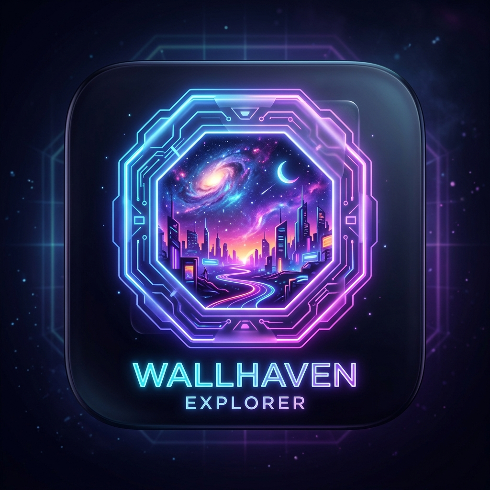

# 🌌 Wallhaven Explorer

[](https://flutter.dev)
[](https://dart.dev)
[](#)
[](#)

Un explorador y gestor de fondos de pantalla prémium para escritorio y móviles que conecta directamente con la API de **Wallhaven**. Diseñado bajo una arquitectura de software limpia y desacoplada utilizando Flutter, Riverpod y SQLite3.

---

<p align="center">
  
</p>

---

## ✨ Características Principales

*   **Búsqueda Dinámica y Filtrado Avanzado**: Filtrado por palabras clave, categorías (*General, Anime, People*) y niveles de pureza (*SFW, Sketchy, NSFW*).
*   **Diseño Premium Adaptativo**:
    *   Temas **Claro** y **Oscuro** reactivos con previsualización en caliente.
    *   Paleta de colores armónica HSL oscura profunda y claras de bajo contraste.
    *   Transiciones suaves y microanimaciones que mejoran la experiencia del usuario (UX).
*   **Visor Interactivo**: Vista de pantalla dividida con soporte nativo de Zoom y Pan interactivos (`InteractiveViewer`).
*   **Redimensionador Móvil Interactivo Dedicado**:
    *   Ventana modal inteligente para recorte manual sobre guías de aspecto de dispositivos populares (iPhone 15 Pro Max, Google Pixel, Samsung Galaxy, Full HD, etc.).
    *   Regla de los tercios integrada para un encuadre fotográfico profesional.
    *   Motor de reescalado inteligente (`SmartCropCentred`, `LetterboxBlack` y `ScaleMaintainAspect`).
*   **Persistencia Local**: Historial de búsquedas recientes y catálogo de favoritos persistidos mediante base de datos **SQLite3**.
*   **Ajustes Maestros**: Configuración interactiva de la clave API (*API Key*), rutas locales absolutas de descarga e historial.

---

## 🛠️ Stack Tecnológico & Arquitectura

El proyecto sigue una estructura limpia guiada por los principios de **Responsabilidad Única (SRP)**, **KISS** y **DRY**:

*   **UI (Vistas)**: Declarativa e interactiva basada en componentes modulares reutilizables.
*   **Gestión de Estado (Riverpod)**: Implementa `Notifier` y `NotifierProvider` para un flujo de datos unidireccional y reactivo.
*   **Servicio de Datos e Imágenes**:
    *   `WallhavenService`: Encargado de las peticiones HTTP seguras y optimizadas hacia la API con la biblioteca `Dio`.
    *   `ImageProcessorService`: Motor de procesamiento gráfico Dart puro (`image` library) para reescalado, recorte con interpolación de calidad y padding físico de imágenes.
    *   `DatabaseService`: Persistencia local SQLite3 optimizada para almacenamiento rápido en disco y simulación segura `:memory:` para pruebas automatizadas.
    *   `ConfigurationService`: Administrador del archivo de ajustes estructurado `config.json`.

---

## 🚀 Instalación y Ejecución en Desarrollo

### Prerrequisitos
*   **Flutter SDK**: `>= 3.0.0`
*   **Dart SDK**: `>= 3.0.0`
*   Herramientas de compilación nativas para Windows (Visual Studio con cargas de trabajo de C++).

### Pasos para Ejecutar
1.  **Clonar el repositorio**:
    ```bash
    git clone https://github.com/Akon2k/Wallhaven.git
    cd Wallhaven/wallhaven_explorer_flutter
    ```
2.  **Obtener dependencias**:
    ```bash
    flutter pub get
    ```
3.  **Ejecutar pruebas unitarias y de integración**:
    ```bash
    flutter test
    ```
4.  **Ejecutar en modo Desarrollo**:
    ```bash
    flutter run -d windows
    ```

---

## 📦 Compilación para Producción

Para generar el ejecutable binario de Windows optimizado y listo para distribución:

```bash
flutter build windows
```

El ejecutable se generará en la ruta:  
`wallhaven_explorer_flutter/build/windows/x64/runner/Release/wallhaven.exe`

---

## 👤 Autor
*   **AkonDeV** — *Ingeniería y Desarrollo Principal* — [GitHub](https://github.com/Akon2k)

---
*Código desarrollado bajo el estándar del Framework FDA-IA 2.0 // AkonDeV 06/2026*
